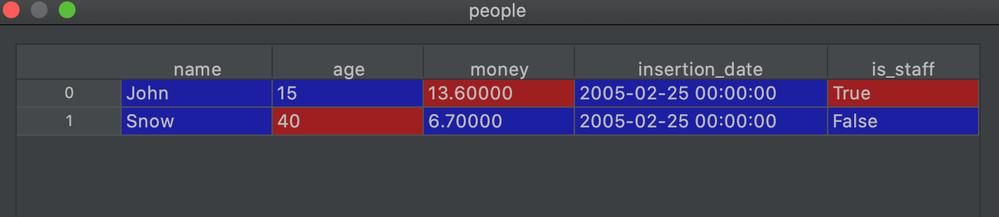

# Pandas-Oop
(Also known as Poop), is a package that uses Pandas dataframes with object oriented programming style

Installation:
- 

```shell script
  pip install pandas-oop
```

Some examples
-

```python
from pandas_oop import models
from pandas_oop.fields import StringColumn, IntegerColumn, FloatColumn, DateColumn, BoolColumn
```
```python
DB_CONNECTION = models.Connection('sqlite:///pandas_oop.db') # this is the same con_string for sqlalchemy engine
```
```python
@models.sql(table='people', con=DB_CONNECTION) # Use this decorator if you want to connect your class to a database
@models.Data
class People(models.DataFrame):
    name = StringColumn(unique=True)
    age = IntegerColumn()
    money = FloatColumn(target_name="coins") # target_name if the name in the csv or table is coins and you want to have a different variable name
    insertion_date = DateColumn(format='%d-%m-%Y')
    is_staff = BoolColumn(true='yes', false='no')
```

Now when instantiating this class, it will return a custom dataframe with all the functionalities of a Pandas
dataframe and some others

```python
people = People()
or
people = People(from_csv=DATA_FILE, delimiter=";")
or
people = People(from_sql_query='select * from people')
or
people = People(from_df=some_dataframe)
or
people = People(from_iterator=some_function_that_yield_values)
```
example of function that yield values:

```python
def some_function_that_yield_values():
    while something:
        ...
        yield name, age, money, insertion_date, is_staff
```



You can also save it to the database with the save() method (if the dtypes of the columns change, this will raise a 
ValidationError):

```python
people.save()
```

You can upsert to the database and this will automatically look at the unique fields that were declared in the class

```python
people.save(if_row_exists='update')
or
people.save(if_row_exists='ignore')
```

If you want to revalidate your dataframe (convert the columns dtypes to the type that was declared in the class), you can 
call the validate() method:

```python
people.validate()
```

You can also validate from another class. For example, you can do something like this:  

```python
people = People(from_csv=DATA_FILE)
jobs = Jobs(from_sql_query='select * from jobs')
people_with_jobs = people.merge(jobs, on='name').validate(from_class=PeopleWithJobs)
```

This is the list of the overriten methods that return a pandas_oop custom dataframe
- 'isnull'
- 'head'
- 'abs'
- 'merge'
- 'loc' and dataframe slicing

I will add more and more methods on this list.


New features
-
Alembic Database migration support added:
- On your main application package, import Base (this is a declarative_base from sqlalchemy)
```python
from pandas_oop import Base
```
- Add this configuration on the env.py file of your alembic config
```python
from your_app import Base
target_metadata = Base.metadata
```
- And finaly, update your database url on your alembic.ini file